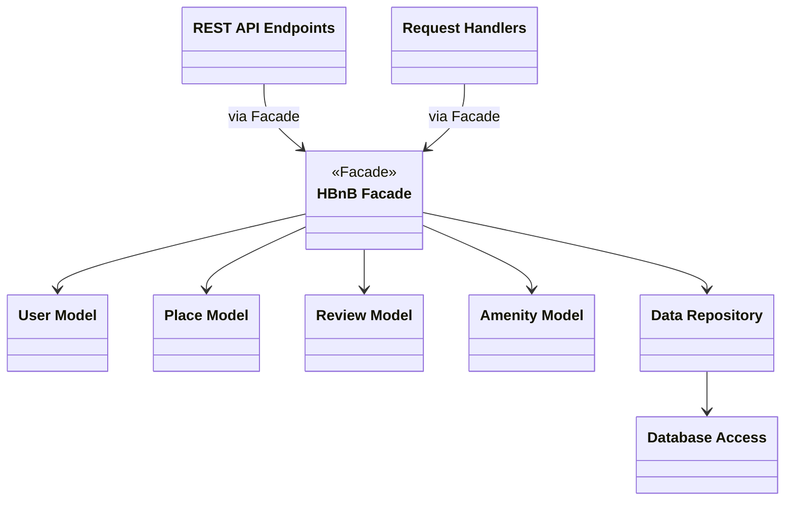

# HBnB Application

A three-layer web application built with a RESTful API, following the Facade Pattern for clean separation of concerns.

## Architecture

The application is organized into three layers:

- **Presentation Layer** — REST API endpoints and request handlers. Entry point for all HTTP requests.
- **Business Logic Layer** — Core models (User, Place, Review, Amenity) and the HBnBFacade interface.
- **Persistence Layer** — Data repository and database access abstraction.

### Package Diagram

## Facade Pattern

The `HBnBFacade` acts as a single entry point between the Presentation and Business Logic layers. This decouples the API from internal model implementation details, so changes to business logic don't affect the API layer.
