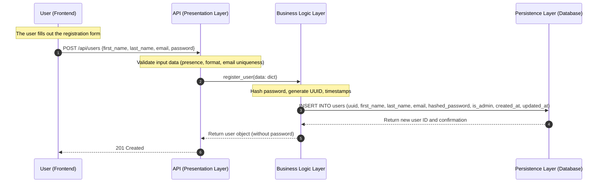
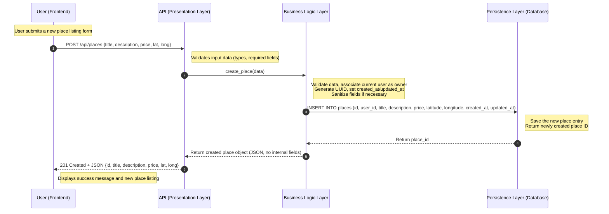
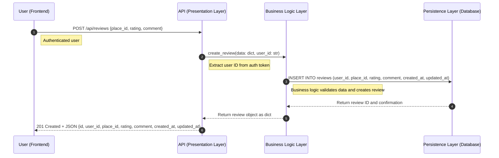
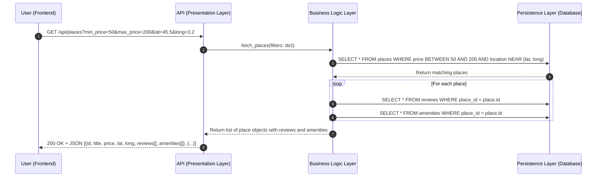

# HBnB Evolution — Technical Architecture Document

**Version:** 1.0  
**Status:** Draft  
**Project:** HBnB Evolution (Holberton School)

---

## Table of Contents

1. [Introduction](#1-introduction)
2. [High-Level Architecture](#2-high-level-architecture)
3. [Business Logic Layer](#3-business-logic-layer)
4. [API Interaction Flow](#4-api-interaction-flow)

---

## 1. Introduction

### 1.1 Purpose

This document provides a comprehensive technical reference for the **HBnB Evolution** project — a simplified, full-stack property rental application modeled after Airbnb. It consolidates the architectural diagrams, design decisions, and data flow specifications produced during the system design phase, and is intended to serve as the authoritative blueprint for all subsequent implementation work.

### 1.2 Project Overview

HBnB Evolution is a web application that enables users to:

- **Register and manage** personal user profiles.
- **Create and browse** property listings (referred to as *Places*).
- **Submit and view** reviews for places they have visited.
- **Associate amenities** (such as Wi-Fi, pool, or parking) with property listings.

The system is designed around a clean, three-layer architecture that enforces a strict separation of concerns between user-facing interfaces, business logic, and data persistence.

### 1.3 Scope of This Document

This document covers three distinct levels of architectural specification:

| Section | Artifact | Purpose |
|---|---|---|
| §2 | High-Level Package Diagram | Defines the macro-level system structure and layer responsibilities |
| §3 | Detailed Class Diagram | Specifies the business entities, their attributes, methods, and relationships |
| §4 | Sequence Diagrams | Illustrates the runtime data flow for four core API operations |

This document is intended for software architects, backend developers, and technical reviewers. It does not cover frontend implementation details, deployment infrastructure, or security hardening beyond what is directly represented in the diagrams.

---

## 2. High-Level Architecture

### 2.1 Package Diagram

The diagram below illustrates the macro-level structure of the HBnB system, organized into three distinct architectural layers. Communication between the Presentation Layer and the Business Logic Layer is mediated exclusively through a **Facade interface**.

---

### 2.2 Layered Architecture

The system follows a classic **three-tier layered architecture**. Each layer has a single, well-defined responsibility and communicates only with its adjacent layer. This design prevents tight coupling, makes individual layers independently testable, and allows future replacement of any tier without cascading changes.

#### 2.2.1 Presentation Layer

The topmost layer is the interface between the external world (browser clients, mobile frontends, or third-party consumers) and the system's internal logic.

**Sub-components:**

- **API** — Exposes RESTful endpoints that receive HTTP requests, deserialize payloads, and enforce input validation before forwarding requests inward.
- **Services** — Orchestrate higher-level request handling logic within the presentation tier, such as request routing and response serialization.

**Responsibilities:**

- Accept and validate incoming HTTP requests (presence checks, format validation, type checking).
- Translate external request data into internal method calls via the Facade.
- Serialize domain objects into HTTP responses and enforce appropriate HTTP status codes.
- Reject malformed or unauthorized requests before they reach the Business Logic Layer.

#### 2.2.2 Business Logic Layer

The middle tier encapsulates all core domain logic and business rules of the application. It is the source of truth for what the application *does*, independent of how it is accessed or how data is stored.

**Sub-components:**

- **User** — Domain model for platform users.
- **Place** — Domain model for property listings.
- **Review** — Domain model for user-submitted feedback.
- **Amenity** — Domain model for place features and attributes.

**Responsibilities:**

- Enforce business rules (for example, a user cannot review their own place).
- Validate domain-level constraints (for example, price must be a positive number).
- Check access permissions and ownership before performing mutations.
- Coordinate between domain models and delegate database operations to the Persistence Layer.

#### 2.2.3 Persistence Layer

The bottom tier is responsible exclusively for durable storage and retrieval of application data. It has no knowledge of business rules or HTTP semantics.

**Sub-components:**

- **Database** — The underlying relational data store.
- **Repositories** — Data Access Objects (DAOs) that translate domain operations into SQL queries and return hydrated domain objects.

**Responsibilities:**

- Execute CRUD operations against the database.
- Abstract raw SQL from the Business Logic Layer.
- Return query results to the Business Logic Layer for further processing.

---

### 2.3 The Facade Pattern

The **Facade Pattern** is used as the sole communication boundary between the Presentation Layer and the Business Logic Layer. Rather than allowing API controllers to instantiate domain models or invoke repository methods directly, all cross-layer calls pass through a single, unified interface: the **Facade**.

**Why the Facade Pattern was chosen:**

- **Decoupling** — The Presentation Layer is isolated from the internal structure of the Business Logic Layer. Controllers do not need to know which domain models or services are involved in fulfilling a request.
- **Simplified API surface** — The Facade presents a single, coherent set of methods (such as `register_user()` and `create_place()`) that map cleanly to application use cases, reducing cognitive overhead for developers working on the presentation tier.
- **Maintainability** — Internal refactoring of the Business Logic Layer (for example, splitting a service or adding a new validation step) does not require changes to the Presentation Layer, as long as the Facade interface contract is preserved.
- **Testability** — The Facade can be mocked in isolation, enabling unit testing of both layers independently.

> **Design note:** The Facade does not add business logic of its own. It is a delegation interface. All domain validation and rule enforcement remains within the Business Logic Layer.

---

### 2.4 Architectural Fit

This layered design with a Facade boundary ensures that:

- The API can be extended (for example, with GraphQL or gRPC endpoints) without modifying business logic.
- The persistence backend can be swapped (for example, from in-memory storage to a relational database) without affecting higher layers.
- Each layer can be independently developed, tested, and deployed.

---

## 3. Business Logic Layer

### 3.1 Class Diagram

The diagram below specifies the four primary domain entities of the HBnB system, their attributes, their methods, and the associations between them.

---

### 3.2 Entities and Attributes

#### 3.2.1 User

The `User` entity represents any person registered on the platform. A user may act as a **guest** (browsing and reviewing places) or as an **owner** (creating and managing property listings).

| Field | Type | Access | Notes |
|---|---|---|---|
| `id` | UUID | Public | Primary key; system-generated at registration |
| `first_name` | String | Public | Required |
| `last_name` | String | Public | Required |
| `email` | String | Public | Required; unique across the system |
| `password` | String | Private | Stored as a cryptographic hash; never exposed in responses |
| `is_admin` | Boolean | Public | Grants elevated platform-level permissions |
| `is_Owner` | Boolean | Public | Set to `true` when the user has at least one active listing |
| `created_at` | DateTime | Public | Set at creation; immutable |
| `updated_at` | DateTime | Public | Updated on every profile modification |

**Methods:**

- `register()` — Creates a new user account, hashes the provided password, and generates a UUID.
- `update_profile()` — Updates mutable profile fields and refreshes `updated_at`.
- `delete()` — Removes the user record and triggers cascading cleanup of owned resources.

---

#### 3.2.2 Place

The `Place` entity represents a property listing created and owned by a registered user. It is the central domain object of the platform.

| Field | Type | Notes |
|---|---|---|
| `id` | UUID | Primary key; system-generated |
| `title` | String | Display name of the listing |
| `description` | String | Free-text description of the property |
| `price` | Float | Nightly rate; must be a positive number |
| `latitude` | Float | Geographic coordinate |
| `longitude` | Float | Geographic coordinate |
| `owner_id` | UUID | Foreign key referencing `User.id` |
| `created_at` | DateTime | Set at creation; immutable |
| `updated_at` | DateTime | Updated on every listing modification |

**Methods:**

- `create()` — Validates listing data, associates the authenticated user as owner, and persists the record.
- `update()` — Modifies mutable listing fields and refreshes `updated_at`.
- `delete()` — Removes the listing and its associated reviews and amenity links.
- `list()` — Retrieves place records matching specified filter criteria.

---

#### 3.2.3 Review

The `Review` entity represents feedback submitted by a user for a place they have visited.

| Field | Type | Notes |
|---|---|---|
| `id` | UUID | Primary key; system-generated |
| `rating` | Integer | Numeric score (typically 1–5) |
| `comment` | String | Free-text feedback |
| `user_id` | UUID | Foreign key referencing `User.id` |
| `place_id` | UUID | Foreign key referencing `Place.id` |
| `created_at` | DateTime | Set at creation; immutable |
| `updated_at` | DateTime | Updated on every edit |

**Methods:**

- `create()` — Validates review data and enforces business rules (for example, prevents self-review).
- `update()` — Modifies rating and/or comment; refreshes `updated_at`.
- `delete()` — Removes the review record.
- `list_by_place()` — Retrieves all reviews associated with a given `place_id`.

---

#### 3.2.4 Amenity

The `Amenity` entity represents a discrete feature or attribute that can be associated with one or more places (for example, Wi-Fi, pool, or air conditioning).

| Field | Type | Notes |
|---|---|---|
| `id` | UUID | Primary key; system-generated |
| `name` | String | Short label for the amenity |
| `description` | String | Optional extended description |
| `created_at` | DateTime | Set at creation; immutable |
| `updated_at` | DateTime | Updated on every modification |

**Methods:**

- `create()` — Creates a new amenity definition.
- `update()` — Modifies the amenity name or description.
- `delete()` — Removes the amenity and all its associations with places.
- `list()` — Retrieves all amenity records.

---

### 3.3 Relationships

| Relationship | Cardinality | Description |
|---|---|---|
| User → Place | 1..n | A user can own one or more places; each place has exactly one owner. |
| User → Review | 1..n | A user can author one or more reviews; each review belongs to exactly one user. |
| Place → Review | 1..1 (per review) | Each review targets exactly one place; a place can have many reviews. |
| Place ↔ Amenity | n..n | A place can have multiple amenities; an amenity can be associated with multiple places. |

---

### 3.4 Design Decisions

- **UUID as primary key** — All entities use UUIDs rather than auto-incrementing integers. This avoids exposing sequential identifiers in the API, simplifies distributed generation, and prevents enumeration attacks.
- **Audit timestamps on every entity** — `created_at` and `updated_at` fields are present on all entities for traceability, debugging, and potential future audit logging.
- **Password encapsulation** — The `password` field on `User` is marked private in the class diagram. It is hashed before persistence and is never returned in any API response.
- **is_Owner flag** — Rather than deriving ownership dynamically via a JOIN at runtime, the `is_Owner` boolean on `User` provides a fast, indexed check for permission-gating listing creation and management.
- **Amenity as a standalone entity** — Amenities are modeled as first-class entities rather than a plain string array on `Place`. This allows amenities to be managed independently, reused across listings, and extended with metadata in the future.

---

## 4. API Interaction Flow

### 4.1 Sequence Diagrams Overview

The sequence diagrams in this section illustrate the runtime communication between the four principal system components for each of the four core API operations:

| Component | Role |
|---|---|
| **Client** | The end user's browser or frontend application |
| **API** | The Presentation Layer; receives HTTP requests and returns HTTP responses |
| **Business Logic Layer** | Validates domain rules, orchestrates operations, coordinates persistence |
| **Persistence Layer (DB)** | Executes SQL queries and returns results |

Each call flows strictly top-down through the layers. Responses return bottom-up along the same path.

---

### 4.2 User Registration

**Endpoint:** `POST /api/users`

**Description:** Handles new user sign-up by validating the submitted data, securely hashing the password, persisting the user record, and returning a sanitized response.

**Step-by-step breakdown:**

1. The client submits a registration form payload containing `first_name`, `last_name`, `email`, and `password`.
2. The API validates the presence and format of all required fields and checks that the email address is not already registered.
3. The API delegates to the Business Logic Layer via `register_user(data)`.
4. The Business Logic Layer hashes the password, generates a UUID, and sets `created_at` and `updated_at` timestamps.
5. The Business Logic Layer issues an `INSERT` to the database via the Persistence Layer.
6. The database confirms the write and returns the new user ID.
7. The Business Logic Layer constructs a user object with the password field excluded and returns it to the API.
8. The API returns `201 Created` with the sanitized user object.

---

### 4.3 Place Creation

**Endpoint:** `POST /api/places`

**Description:** Allows an authenticated user to create a new property listing. The system validates the submitted data, associates the listing with the authenticated owner, and returns the created object.

**Step-by-step breakdown:**

1. The client (authenticated user) submits a listing payload containing `title`, `description`, `price`, `latitude`, and `longitude`.
2. The API validates field types and required field presence.
3. The API delegates to the Business Logic Layer via `create_place(data)`.
4. The Business Logic Layer extracts the authenticated user's ID, associates them as the owner, generates a UUID, and sets timestamps.
5. The Business Logic Layer persists the record via an `INSERT` to the database.
6. The database saves the entry and returns the new `place_id`.
7. The Business Logic Layer constructs the place object, strips any internal fields, and returns it to the API.
8. The API returns `201 Created` with a JSON body containing the full place object.

---

### 4.4 Review Submission

**Endpoint:** `POST /api/reviews`

**Description:** Allows an authenticated user to submit a review for a place. The system verifies authorization, validates the review data, and persists the record.

**Step-by-step breakdown:**

1. The authenticated client submits a payload containing `place_id`, `rating`, and `comment`.
2. The API extracts the authenticated user's ID from the authorization token.
3. The API delegates to the Business Logic Layer via `create_review(data, user_id)`.
4. The Business Logic Layer validates the data (for example, verifying the place exists and the user is not reviewing their own listing) and persists the record.
5. The database confirms the write and returns the new review ID.
6. The Business Logic Layer constructs the review object and returns it to the API.
7. The API returns `201 Created` with the full review object as JSON.

---

### 4.5 Fetching a List of Places

**Endpoint:** `GET /api/places`

**Description:** Retrieves a filtered list of place listings. For each matching place, the system also fetches the associated reviews and amenities, returning a fully enriched response.

**Step-by-step breakdown:**

1. The client sends a `GET` request with optional query parameters to filter results by price range and geographic proximity.
2. The API passes the filter parameters to the Business Logic Layer via `fetch_places(filters)`.
3. The Business Logic Layer constructs and executes a parameterized query to the database, filtering by price range and location.
4. The database returns all matching place records.
5. For each returned place, the Business Logic Layer issues two additional queries: one for associated reviews and one for associated amenities.
6. The Business Logic Layer assembles the enriched place objects (with nested `reviews[]` and `amenities[]` arrays) and returns the list to the API.
7. The API returns `200 OK` with a JSON array of fully enriched place objects.

> **Performance note:** The per-place nested queries in step 5 introduce an N+1 query pattern. In a production system, this should be addressed using a JOIN-based query or a batch-fetch strategy to avoid linear query growth as the result set scales.

---

### 4.6 Design Decisions

- **Strict layer traversal** — Every API call flows through all three layers in sequence. No layer bypasses another. This ensures that business rules are always applied, regardless of the call origin.
- **Authorization at the API boundary** — User identity is extracted from the authentication token at the Presentation Layer and passed into the Business Logic Layer as a parameter. The Business Logic Layer does not handle token parsing.
- **Sanitized responses** — Sensitive fields (such as `password` and internal system fields) are stripped before data is returned from the Business Logic Layer to the API. Callers never receive raw database records.
- **Consistent HTTP status codes** — Successful creation operations return `201 Created`. Successful read operations return `200 OK`. This aligns with REST conventions and allows clients to distinguish between resource creation and retrieval.
- **Enriched list responses** — The place listing endpoint returns nested review and amenity data in a single response rather than requiring the client to make multiple follow-up requests. This reduces round-trip latency for the most common client use case.

---

## 5. Summary

This document has presented the complete architectural blueprint for the HBnB Evolution application across three levels of abstraction:

| Level | Artifact | Key Takeaway |
|---|---|---|
| Macro | High-Level Package Diagram | Three-tier layered architecture with a Facade boundary between Presentation and Business Logic |
| Micro | Detailed Class Diagram | Four domain entities (User, Place, Review, Amenity) with UUID keys, audit timestamps, and clear ownership relationships |
| Runtime | Sequence Diagrams | Strict top-down layer traversal for all operations; sanitized responses; authorization at the API boundary |

This blueprint should remain the reference for architectural decisions throughout all subsequent development phases. Any deviation from the patterns described here — particularly the layer communication contracts and the Facade interface — should be reviewed and documented as a deliberate architectural decision.
